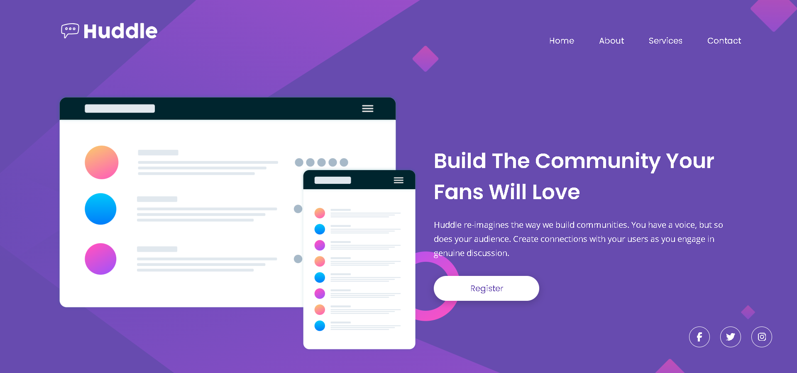
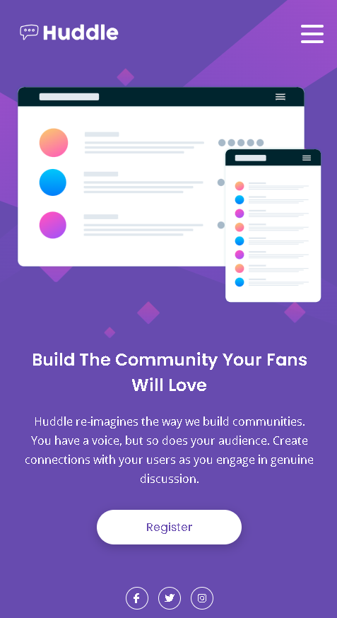

# Huddle Landing Page

Bu proje, Frontend Mentor platformunun sağladığı tasarıma uygun, duyarlı (responsive) bir "Huddle" açılış sayfası oluşturmayı amaçlamaktadır. Masaüstü, tablet ve mobil cihazlarda tutarlı bir kullanıcı deneyimi sunmak hedeflenmiştir.

## Canlı Demo

Projenin canlı halini aşağıdaki linkten inceleyebilirsiniz:

[Canlı Demoyu Görüntüle](https://yunussakal.github.io/Huddle-Landing-Page/)

###  Masaüstü Görünümü

###  Mobil Görünümü

## Kullanılan Teknolojiler

* HTML5
* CSS3
* Responsive Tasarım (Media Queries)
* JavaScript (Mobil menü işlevselliği için)

## Hover Efektleri

Projede aşağıdaki öğeler için hover efektleri uygulanmıştır:

* Kayıt Ol butonu (arka plan ve yazı rengi değişimi)
* Sosyal medya ikonları (renk ve kenarlık rengi değişimi)
* Navigasyon linkleri (renk değişimi ve alt çizgi)
